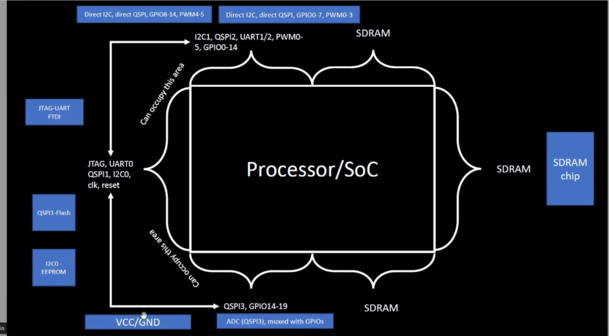
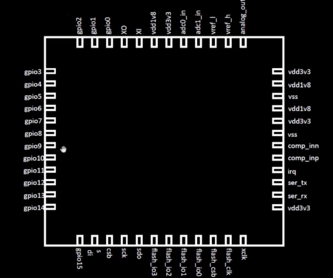
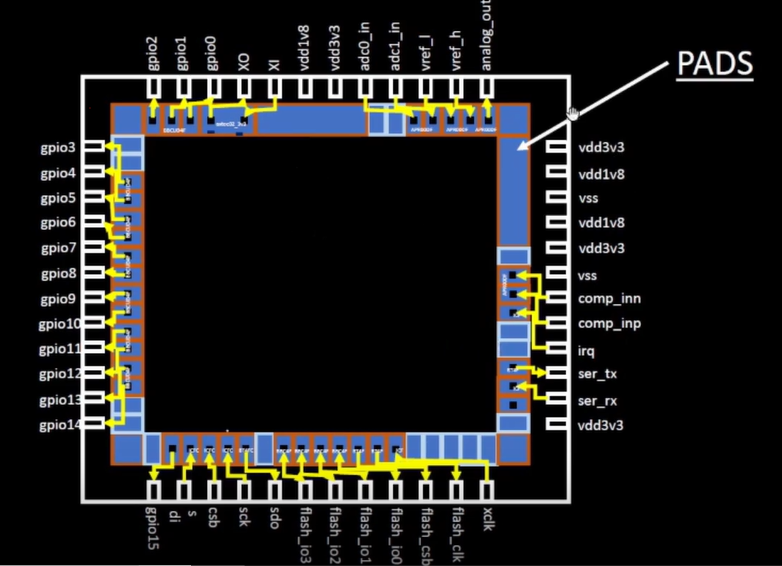
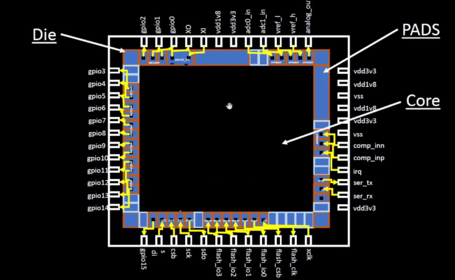
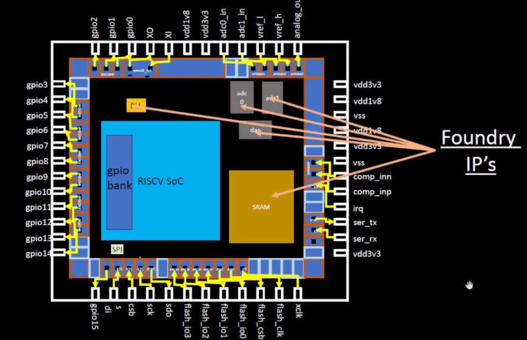

# NASSCOM VSD SOC DESIGN DOCUMENTATION

## Overview
In this documentation, we'll deep dive into the chip's internal building blocks and explore what lies inside the chip itself. Understanding the fundamental architecture and components that make up modern System-on-Chip designs is crucial for effective SoC development. We'll examine the various functional units, interconnects, memory systems, and peripheral interfaces that together form the complete integrated circuit solution.

## System Architecture Block Diagram
The block diagram illustrates the typical architecture of our processor system and its essential components. At the center lies the main processor core, surrounded by various peripheral interfaces that enable communication with external devices. The system includes a JTAG interface for programming and debugging the processor, QSPI1-Flash for non-volatile storage, and an I2C0 bus for connecting to EEPROM. Power management is handled through VCC and ground connections, while analog input capabilities are provided by ADC channels that are multiplexed with GPIO pins for flexible I/O configurations. An SDRAM interface allows for mounting external memory chips to expand the system's memory capacity. This represents the standard layout of a complete embedded processing solution on a single board.

## Getting Inside the Chip

### Chip Packaging
The processor is housed in a QFN-48 package (Quad Flat No-leads), which is a common package type in modern electronics. This particular package measures 7×7 mm, with the silicon chip positioned in the center of the package. The connection between the chip and the package is established through wire bonds, which are thin metal wires that transfer signals between the chip's pads and the package's leads. This wire bonding technique enables the external signals to reach the internal circuitry of the chip and allows the chip to communicate with the outside world.

The silicon die contains metal pads around its perimeter that serve as the interface points for electrical connections. These pads are the critical junctions where signals transition between the external package and the internal chip circuitry. Via these pads, electrical signals can be transmitted into and out of the chip, allowing the processor to interact with external components on the board while executing its internal operations.

At the heart of the chip is the core, which contains all the digital logic circuitry - the chipsets, OR gates, AND gates, and various other logic elements that perform the processor's computational functions. The die represents the entire silicon chip, encompassing both the core and the peripheral circuitry. This silicon foundation is where all the transistors and interconnects are fabricated to create the complete integrated circuit.

A typical modern chip integrates several critical components that function together as a complete system. At its center is the RISC-V SoC (System-on-Chip), which serves as the main processing unit implementing the open-standard RISC-V instruction set architecture. Supporting the processor is SRAM (Static Random-Access Memory) that provides fast, volatile memory storage for immediate data access.

For interfacing with analog signals, the chip incorporates DAC (Digital-to-Analog Converter) and multiple ADC (Analog-to-Digital Converter) blocks like ADC0 and ADC1, enabling the digital chip to interact with the analog world. The PLL (Phase-Locked Loop) generates stable clock signals necessary for synchronizing all digital operations within the chip.

These components are typically implemented as foundry IPs (Intellectual Property blocks) - pre-designed, pre-verified functional units provided by semiconductor foundries that chip designers can incorporate into their designs. Using these foundry IPs significantly reduces development time and ensures reliable performance of critical functions within the SoC design.
 
In addition to foundry IPs, chip designs also utilize macros - pre-designed functional blocks that are smaller than full IPs but larger than standard cells. Macros include elements such as memory arrays, register files, multipliers, and other specialized functions that can be reused across different parts of the design or in multiple projects. They can be either hard macros with fixed layouts or soft macros with parameterizable designs. By leveraging these pre-verified building blocks, designers can focus on system-level architecture and custom logic while reducing development time and minimizing design risks.