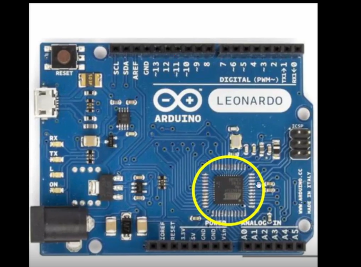

# NASSCOM VSD SOC DESIGN DOCUMENTATION

## Overview
In this documentation, we'll deep dive into the chip's internal building blocks and explore what lies inside the chip itself. Understanding the fundamental architecture and components that make up modern System-on-Chip designs is crucial for effective SoC development. We'll examine the various functional units, interconnects, memory systems, and peripheral interfaces that together form the complete integrated circuit solution.